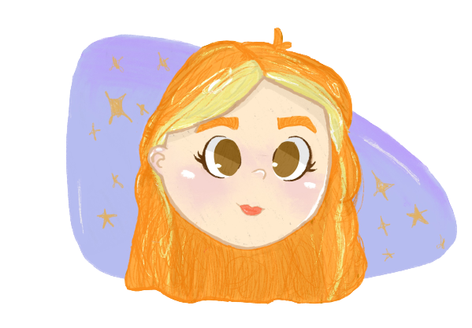

<!--Visitors-->

<!-- Mi presentación-->

  

<h1 align="center"> Hi, there I'm Fer ✨ </h1>

## Sobre mi👋

- Actualmente trabajo en B-more como AMS trainee consultant. 👩‍💻
  
- Estoy estudiando ciencias de la computación en la FC, UNAM. 📚
  
- Estoy aprendiendo desarrollo web (principalmente frontend). ✨
  
- Tengo interés en UX/UI, ciberseguridad y diseño. 👾

- Me gusta el anime, el manga, el kpop e indie alternativo y dibujar. 🎵

<!-- Skills and knowledge -->
## Skills 💻
 
 

 

  
<!--
  Github stats
-->
## GitHub Stats 📈

## Spotify 🎧

<!--My social media.-->
##  Conecta conmigo 🤞
  
